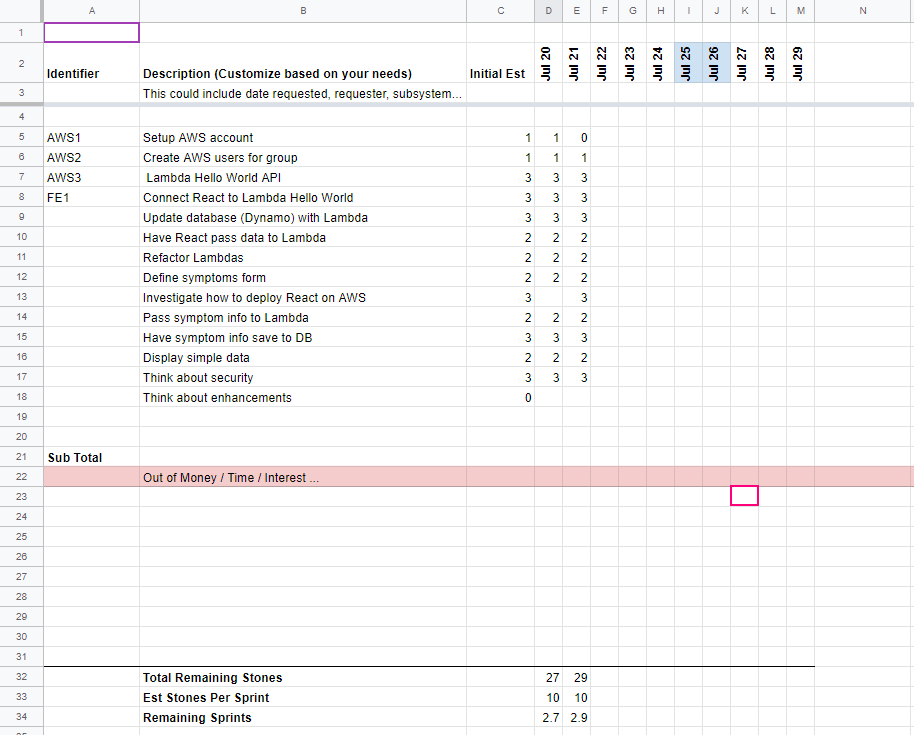

# SpaceTrace

This is the group repository for our SpaceTrace Covid-19 sign-in app for businesses.
We are using a React front-end and an AWS Lambda serverless back-end with AWS DynamoDB.


## Contributors:

- Uranka Bazarsad - [github.com/urankab](https://github.com/urankab)
- Stephen Brousseau - [github.com/sbrew](https://github.com/sbrew)
- Douglas Dougan - [github.com/djdougan](https://github.com/djdougan)
- Sean Mortimer - [github.com/seanmortimer](https://github.com/seanmortimer)
- Rob Soza - [github.com/robsoza](https://github.com/robsoza)
- Zack Wang  -  [github.com/Zackwang07](https://github.com/Zackwang07)


## Tools Used:

### Project Management:

- Product backlog sheet - [Google Sheet](https://docs.google.com/spreadsheets/d/1yLSO0SD3lY0jSJS1xBpPcPPakNdJUncihNpzdRc0RQg/edit?usp=sharing)



### Cloud Services: 
- Serverless Back-end: AWS Lambda - [aws.amazon.com/lambda](https://aws.amazon.com/lambda)
- NoSQL Database: AWS DynamoDB - [aws.amazon.com/dynamodb](https://aws.amazon.com/dynamodb)
- API: AWS API Gateway - [aws.amazon.com/api-gateway](https://aws.amazon.com/api-gateway/)

### Python
- Python 3.8 - [python.org](https://python.org)


## Clone this Repository

For the following instructions use your command line. In Windows, it could be dos or PowerShell. For mac and Linux use terminal.

1. Clone this repository. In your command line move to the directory that you would like to use as your base code directory. 
```sh
git clone https://github.com/seanmortimer/cohort4-group.git
```

This repository has a number of projects within it. Each folder is a project. See the README.md in each folder for further instructions. 

